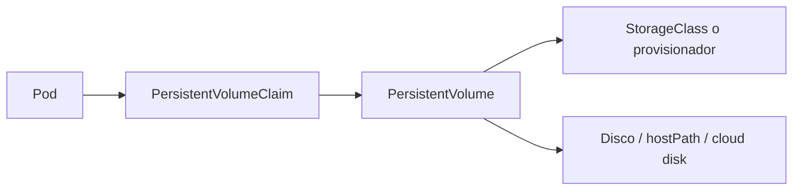

# Curso practico de Docker y Kubernetes

## 1. Docker desde cero

### Comprobar Docker

```powershell
docker version
```

Muestra la version del cliente y del servidor Docker.

```powershell
docker info
```

Muestra el runtime, almacenamiento, registros y contenedores configurados.

### Descargar una imagen

```powershell
docker pull nginx:1.27-alpine
```

- `docker pull`: descarga una imagen.
- `nginx`: nombre del repositorio.
- `1.27-alpine`: etiqueta de version y variante.

### Ejecutar un contenedor

```powershell
docker run --name web-demo -d -p 8080:80 nginx:1.27-alpine
```

- `run`: crea y arranca un contenedor.
- `--name web-demo`: asigna un nombre legible.
- `-d`: lo deja en segundo plano.
- `-p 8080:80`: conecta el puerto 8080 del equipo con el puerto 80 del contenedor.
- `nginx:1.27-alpine`: imagen usada.

Abrir:

```text
http://localhost:8080
```

### Inspeccionar contenedores

```powershell
docker ps
```

Lista contenedores activos.

```powershell
docker ps -a
```

Lista activos y detenidos.

```powershell
docker logs web-demo
```

Muestra la salida del proceso.

```powershell
docker logs -f web-demo
```

Sigue los logs en tiempo real.

```powershell
docker exec -it web-demo sh
```

Abre una terminal dentro del contenedor. En Alpine normalmente se usa `sh`, no `bash`.

```powershell
docker inspect web-demo
```

Muestra configuracion detallada, red, volumenes e identificadores.

```powershell
docker stop web-demo
docker rm web-demo
```

Detiene y elimina el contenedor.

### Imagenes locales

```powershell
docker images
```

Lista imagenes locales.

```powershell
docker rmi nginx:1.27-alpine
```

Elimina una imagen que no este siendo usada.

```powershell
docker image prune
```

Elimina imagenes no utilizadas.

---

## 2. Dockerfile y multistage

Un Dockerfile es un archivo de instrucciones para construir una imagen.

### Dockerfile basico

```dockerfile
# Usa Node sobre Alpine como imagen base.
FROM node:22-alpine

# Define la carpeta de trabajo.
WORKDIR /app

# Copia la declaracion de dependencias primero.
COPY package*.json ./

# Instala dependencias de produccion.
RUN npm ci --omit=dev

# Copia el codigo de la aplicacion.
COPY . .

# Documenta el puerto de la aplicacion.
EXPOSE 8080

# Comando ejecutado al iniciar el contenedor.
CMD ["node", "server.js"]
```

### Explicacion linea por linea

- `FROM`: selecciona una imagen base.
- `WORKDIR`: fija el directorio actual de las siguientes instrucciones.
- `COPY`: copia archivos desde el contexto de construccion.
- `RUN`: ejecuta una orden durante la construccion.
- `EXPOSE`: documenta el puerto; no lo publica por si solo.
- `CMD`: define el proceso principal del contenedor.

### Construir una imagen

```powershell
docker build -t demo-web:1.0 .
```

- `build`: construye una imagen.
- `-t demo-web:1.0`: asigna nombre y etiqueta.
- `.`: usa la carpeta actual como contexto.

### Multistage build

Permite usar una imagen grande para compilar y una imagen final mas pequena para ejecutar.

```dockerfile
# Etapa de compilacion.
FROM node:22-alpine AS build

# Carpeta de trabajo de la compilacion.
WORKDIR /app

# Copia las dependencias.
COPY package*.json ./

# Instala y compila la aplicacion.
RUN npm ci && npm run build

# Copia el codigo fuente.
COPY . .

# Compila la aplicacion.
RUN npm run build

# Etapa final de ejecucion.
FROM nginx:1.27-alpine AS runtime

# Elimina el contenido estatico predeterminado.
RUN rm -rf /usr/share/nginx/html/*

# Copia solo el resultado compilado.
COPY --from=build /app/dist /usr/share/nginx/html

# Documenta el puerto HTTP.
EXPOSE 80

# Ejecuta Nginx en primer plano.
CMD ["nginx", "-g", "daemon off;"]
```

## 3. Redes y volumenes en Docker

Una red Docker permite que los contenedores se encuentren por nombre.

```powershell
docker network create demo-net
docker run -d --name db --network demo-net postgres:16-alpine
docker run -d --name api --network demo-net demo-api:1.0
```

Dentro de `api`, el hostname de la base es `db`, no `localhost`.

Los volumenes conservan datos fuera del ciclo de vida del contenedor:

```powershell
docker volume create db-data
docker run -d --name db -v db-data:/var/lib/postgresql/data postgres:16-alpine
```

## 4. Que es Kubernetes

Kubernetes automatiza el despliegue, escalado, red, recuperacion y configuracion de contenedores.

- **API Server:** recibe las operaciones del cluster.
- **Scheduler:** decide en que nodo colocar cada Pod.
- **Controller Manager:** corrige diferencias entre estado deseado y actual.
- **etcd:** almacena el estado de Kubernetes.
- **Kubelet:** ejecuta instrucciones en cada nodo.
- **kube-proxy:** mantiene las reglas de red que permiten que los Services dirijan trafico hacia los Pods correctos.

`kube-proxy` normalmente se ejecuta como un DaemonSet del sistema, uno por nodo. Observa los Services y sus endpoints, y configura reglas de red usando mecanismos como iptables o IPVS. No es un proxy HTTP tradicional; trabaja principalmente en la capa de red de los Services.

## 5. Instalar un laboratorio local

```powershell
minikube start --driver=docker
minikube status
kubectl get nodes
```

Resultado esperado: el nodo aparece con estado `Ready`.

```powershell
minikube addons enable ingress
minikube addons enable metrics-server
```

---

## 6. Namespaces

Un namespace separa recursos dentro del mismo cluster. Sirve para organizar equipos, ambientes o aplicaciones.

```yaml
apiVersion: v1 # Version de la API principal.
kind: Namespace # Declara un namespace.
metadata: # Metadatos del recurso.
  name: demo # Nombre del namespace.
```

Aplicar:

```powershell
kubectl apply -f namespace.yaml
kubectl get namespaces
```

Consultar recursos:

```powershell
kubectl get pods -n demo
kubectl get all -n demo
```

Un namespace no es una frontera de seguridad completa. Para seguridad se combinan RBAC, NetworkPolicies, Secrets y controles de admision.

---

## 7. Pods y controladores

### Pod

Un Pod es la unidad minima desplegable de Kubernetes. Normalmente contiene un contenedor, aunque puede tener varios contenedores estrechamente relacionados.

```yaml
apiVersion: v1 # Version de la API para Pods.
kind: Pod # Declara un Pod directo.
metadata: # Identidad y etiquetas.
  name: web-pod # Nombre del Pod.
  namespace: demo # Namespace del Pod.
  labels: # Etiquetas para seleccionarlo.
    app: web # Etiqueta de aplicacion.
spec: # Estado deseado.
  containers: # Lista de contenedores.
    - name: web # Nombre del contenedor.
      image: nginx:1.27-alpine # Imagen a ejecutar.
      ports: # Puertos declarados.
        - name: http # Nombre del puerto.
          containerPort: 80 # Puerto dentro del contenedor.
```

Un Pod directo no es ideal para aplicaciones normales porque no ofrece actualizaciones progresivas ni replicas administradas. Para eso se usan controladores.

### Deployment

Usalo para aplicaciones stateless como APIs y frontends.

```yaml
apiVersion: apps/v1 # API de Deployments.
kind: Deployment # Controlador de replicas y actualizaciones.
metadata: # Identidad del recurso.
  name: web # Nombre del Deployment.
  namespace: demo # Namespace objetivo.
spec: # Estado deseado.
  replicas: 3 # Mantiene tres Pods.
  selector: # Selecciona los Pods administrados.
    matchLabels: # Regla de seleccion.
      app: web # Debe coincidir con la plantilla.
  template: # Plantilla de cada Pod.
    metadata: # Metadatos del Pod.
      labels: # Etiquetas del Pod.
        app: web # Etiqueta usada por el selector.
    spec: # Configuracion del Pod.
      containers: # Contenedores del Pod.
        - name: web # Nombre del contenedor.
          image: nginx:1.27-alpine # Imagen de la aplicacion.
          ports: # Puertos del contenedor.
            - containerPort: 80 # Puerto HTTP.
```

Kubernetes crea un ReplicaSet y el ReplicaSet crea los Pods. Si un Pod muere, el controlador crea otro.

```powershell
kubectl apply -f deployment.yaml
kubectl get deployment,replicaset,pods -n demo
kubectl scale deployment web --replicas=5 -n demo
kubectl rollout status deployment/web -n demo
kubectl rollout undo deployment/web -n demo
```

### StatefulSet

Usalo para bases de datos o sistemas que necesitan identidad estable, orden de arranque y volumen dedicado.

```yaml
apiVersion: apps/v1 # API de StatefulSet.
kind: StatefulSet # Controlador para aplicaciones con estado.
metadata: # Identidad del recurso.
  name: database # Nombre del StatefulSet.
  namespace: demo # Namespace objetivo.
spec: # Estado deseado.
  serviceName: database # Service headless asociado.
  replicas: 1 # Numero de instancias.
  selector: # Seleccion de Pods.
    matchLabels: # Coincidencia de etiquetas.
      app: database # Etiqueta esperada.
  template: # Plantilla de Pod.
    metadata: # Metadatos.
      labels: # Etiquetas del Pod.
        app: database # Identifica la base.
    spec: # Configuracion del Pod.
      containers: # Contenedores.
        - name: database # Nombre del contenedor.
          image: postgres:16-alpine # Imagen PostgreSQL.
          ports: # Puertos.
            - name: postgres # Nombre del puerto.
              containerPort: 5432 # Puerto PostgreSQL.
          volumeMounts: # Montajes.
            - name: data # Nombre del volumen.
              mountPath: /var/lib/postgresql/data # Carpeta de datos.
  volumeClaimTemplates: # Crea un PVC por replica.
    - metadata: # Identidad del PVC generado.
        name: data # Nombre del volumen.
      spec: # Solicitud de almacenamiento.
        accessModes: ["ReadWriteOnce"] # Escritura desde un nodo.
        resources: # Recursos de almacenamiento.
          requests: # Minimo solicitado.
            storage: 10Gi # Diez GiB por instancia.
```

Un StatefulSet **no convierte por si solo una base en HA**. Para replicacion y failover se necesita PostgreSQL configurado para ello, un operador o una solucion especializada.

### DaemonSet

Crea un Pod por nodo. Es apropiado para agentes de logs, monitoreo o networking.

```yaml
apiVersion: apps/v1 # API de DaemonSet.
kind: DaemonSet # Un Pod por nodo elegible.
metadata: # Identidad.
  name: node-agent # Nombre del agente.
  namespace: demo # Namespace.
spec: # Estado deseado.
  selector: # Selector de Pods.
    matchLabels: # Coincidencia.
      app: node-agent # Etiqueta del agente.
  template: # Plantilla.
    metadata: # Metadatos.
      labels: # Etiquetas.
        app: node-agent # Etiqueta seleccionable.
    spec: # Configuracion.
      containers: # Contenedores.
        - name: agent # Nombre del agente.
          image: fluent/fluent-bit:3.2.10 # Imagen del agente.
```

Combinarlo con `nodeSelector`:

```yaml
nodeSelector:
  kubernetes.io/os: linux
```

`nodeSelector` decide donde puede correr un Pod; `DaemonSet` decide cuantos Pods crear.

### Job

Ejecuta una tarea hasta completarla.

```yaml
apiVersion: batch/v1 # API de Jobs.
kind: Job # Trabajo que termina.
metadata: # Identidad.
  name: migration # Nombre del trabajo.
  namespace: demo # Namespace.
spec: # Configuracion.
  backoffLimit: 2 # Reintentos permitidos.
  template: # Plantilla del Pod.
    spec: # Configuracion del Pod.
      restartPolicy: Never # El Job controla los reintentos.
      containers: # Contenedores.
        - name: task # Nombre.
          image: alpine:3.20 # Imagen.
          command: ["sh", "-c", "echo migracion completa"] # Tarea ejecutada.
```

### CronJob

Ejecuta Jobs usando una expresion cron.

```yaml
apiVersion: batch/v1 # API de CronJob.
kind: CronJob # Trabajo programado.
metadata: # Identidad.
  name: health-check # Nombre.
  namespace: demo # Namespace.
spec: # Configuracion.
  schedule: "*/5 * * * *" # Cada cinco minutos.
  concurrencyPolicy: Forbid # No permite solapamiento.
  jobTemplate: # Plantilla de cada Job.
    spec: # Configuracion del Job.
      ttlSecondsAfterFinished: 300 # Borra Job y Pod cinco minutos despues.
      template: # Plantilla del Pod.
        spec: # Configuracion del Pod.
          restartPolicy: Never # No reinicia el Pod directamente.
          containers: # Contenedores.
            - name: check # Nombre.
              image: postgres:16-alpine # Imagen con herramientas de salud.
              command: ["sh", "-c", "pg_isready -h database"] # Comprobacion.
```

---

## 8. Services

Los Pods son efimeros y sus IPs pueden cambiar. Un Service ofrece una direccion estable y balancea trafico entre Pods seleccionados.

```yaml
apiVersion: v1 # API principal.
kind: Service # Recurso de red estable.
metadata: # Identidad.
  name: web # Nombre DNS interno.
  namespace: demo # Namespace.
spec: # Configuracion de red.
  type: ClusterIP # Solo accesible dentro del cluster.
  selector: # Pods destino.
    app: web # Debe coincidir con las etiquetas.
  ports: # Puertos publicados.
    - name: http # Nombre del puerto.
      port: 80 # Puerto del Service.
      targetPort: http # Puerto del Pod, por nombre.
```

DNS interno:

```text
web.demo.svc.cluster.local
```

Dentro del mismo namespace normalmente basta:

```text
web
```

### Tipos de Service

| Tipo | Uso |
|---|---|
| `ClusterIP` | Acceso interno, valor por defecto |
| `NodePort` | Publica un puerto en cada nodo |
| `LoadBalancer` | Solicita un balanceador externo |
| `ExternalName` | Alias DNS hacia un servicio externo |

Ejemplos:

```powershell
kubectl get service -n demo
kubectl get endpoints -n demo
kubectl describe service web -n demo
```

Un Service selecciona por etiquetas, no por nombre del Deployment.

---

## 9. Ingress y TLS

Un Ingress enruta HTTP/HTTPS hacia Services internos. Necesita un **Ingress Controller**, por ejemplo Nginx.

```powershell
minikube addons enable ingress
```

### Ingress HTTP

```yaml
apiVersion: networking.k8s.io/v1 # API de Ingress.
kind: Ingress # Reglas HTTP/HTTPS.
metadata: # Identidad y anotaciones.
  name: web # Nombre del Ingress.
  namespace: demo # Namespace.
spec: # Reglas deseadas.
  ingressClassName: nginx # Controlador que procesara el recurso.
  rules: # Reglas por hostname.
    - host: app.example.test # Dominio recibido en la peticion.
      http: # Configuracion HTTP.
        paths: # Rutas.
          - path: / # Ruta principal.
            pathType: Prefix # Coincide con subrutas.
            backend: # Destino.
              service: # Service backend.
                name: web # Service de la aplicacion.
                port: # Puerto del Service.
                  number: 80 # Puerto HTTP.
```

El flujo es:

```text
Cliente -> Ingress Controller -> Ingress rule -> Service -> Pods
```

### TLS con Secret

Crear un certificado local:

```powershell
kubectl create secret tls web-tls `
  --cert=.\tls\tls.crt `
  --key=.\tls\tls.key `
  -n demo
```

Ingress HTTPS:

```yaml
spec: # Configuracion del Ingress.
  ingressClassName: nginx # Controlador Nginx.
  tls: # Lista de configuraciones TLS.
    - hosts: # Hostnames cubiertos.
        - app.example.test # Nombre incluido en el certificado.
      secretName: web-tls # Secret con tls.crt y tls.key.
  rules: # Reglas HTTP que seran servidas sobre TLS.
    - host: app.example.test # Hostname de la aplicacion.
      http: # Enrutamiento HTTP interno del Ingress.
        paths: # Rutas.
          - path: / # Ruta principal.
            pathType: Prefix # Incluye subrutas.
            backend: # Destino.
              service: # Service backend.
                name: web # Nombre del Service.
                port: # Puerto del Service.
                  number: 80 # Puerto web.
```

Para forzar redireccion:

```yaml
metadata:
  annotations:
    nginx.ingress.kubernetes.io/ssl-redirect: "true"
```

En produccion se recomienda `cert-manager` y una autoridad certificadora confiable. Un certificado autofirmado cifra la conexion, pero genera una advertencia en el navegador.

---

## 10. ConfigMaps y Secrets

### ConfigMap

Guarda configuracion no sensible.

```yaml
apiVersion: v1 # API principal.
kind: ConfigMap # Recurso de configuracion.
metadata: # Identidad.
  name: app-config # Nombre.
  namespace: demo # Namespace.
data: # Pares de configuracion.
  APP_MODE: production # Valor de texto.
  LOG_LEVEL: info # Nivel de logs.
```

Usarlo como variables:

```yaml
envFrom:
  - configMapRef:
      name: app-config
```

Usarlo como archivo:

```yaml
volumes:
  - name: config
    configMap:
      name: app-config
```

### Secret

Guarda datos sensibles, pero por defecto Kubernetes los almacena codificados en Base64, no cifrados automaticamente.

```yaml
apiVersion: v1 # API principal.
kind: Secret # Recurso de datos sensibles.
metadata: # Identidad.
  name: db-credentials # Nombre.
  namespace: demo # Namespace.
type: Opaque # Tipo generico.
stringData: # Kubernetes codifica estos valores al guardar el Secret.
  DB_USER: appuser # Usuario.
  DB_PASSWORD: change-me # Password de ejemplo.
```

Inyectar una clave concreta:

```yaml
env:
  - name: DB_PASSWORD
    valueFrom:
      secretKeyRef:
        name: db-credentials
        key: DB_PASSWORD
```

Buenas practicas:

- No guardar passwords reales en Git.
- Usar un gestor externo de secretos en produccion.
- Limitar acceso con RBAC.
- Rotar credenciales.
- Evitar imprimir Secrets en logs.

---

## 11. Requests, limits y ResourceQuota

### Requests y limits

```yaml
resources:
  requests:
    cpu: 100m
    memory: 128Mi
  limits:
    cpu: 500m
    memory: 256Mi
```

- `requests`: recursos usados por el scheduler para colocar el Pod y garantizados como reserva.
- `limits`: techo de consumo del contenedor.
- `100m`: 100 millicores, aproximadamente una decima de CPU.
- `Mi`: mebibytes.

Un Pod sin recursos puede ser rechazado cuando existe una cuota que los exige.

### ResourceQuota

```yaml
apiVersion: v1 # API principal.
kind: ResourceQuota # Limita el consumo de un namespace.
metadata: # Identidad.
  name: demo-quota # Nombre.
  namespace: demo # Namespace controlado.
spec: # Limites.
  hard: # Valores maximos.
    pods: "20" # Maximo de Pods.
    services: "10" # Maximo de Services.
    persistentvolumeclaims: "10" # Maximo de PVCs.
    requests.cpu: "4" # CPU total solicitada.
    requests.memory: 8Gi # Memoria total solicitada.
    limits.cpu: "8" # CPU total maxima.
    limits.memory: 16Gi # Memoria total maxima.
```

Consultar:

```powershell
kubectl get resourcequota -n demo
kubectl describe resourcequota demo-quota -n demo
```

Si aparece `must specify limits.cpu`, el Pod necesita definir `requests` y `limits`.

---

## 12. StorageClass, PV y PVC

### Las tres piezas

- **StorageClass:** describe como aprovisionar almacenamiento.
- **PersistentVolume (PV):** almacenamiento disponible.
- **PersistentVolumeClaim (PVC):** solicitud hecha por una aplicacion.



### StorageClass local de laboratorio

```yaml
apiVersion: storage.k8s.io/v1 # API de StorageClass.
kind: StorageClass # Clase de almacenamiento.
metadata: # Identidad.
  name: local-storage # Nombre.
provisioner: kubernetes.io/no-provisioner # PV administrado manualmente.
volumeBindingMode: WaitForFirstConsumer # Espera al Pod para seleccionar nodo.
reclaimPolicy: Retain # Conserva datos al borrar el PVC.
```

### PV

```yaml
apiVersion: v1 # API principal.
kind: PersistentVolume # Volumen disponible.
metadata: # Identidad.
  name: app-pv # Nombre.
spec: # Propiedades.
  capacity: # Capacidad.
    storage: 10Gi # Diez GiB.
  volumeMode: Filesystem # Se monta como sistema de archivos.
  accessModes: # Modos de acceso.
    - ReadWriteOnce # Escritura desde un nodo.
  persistentVolumeReclaimPolicy: Retain # Retiene el volumen.
  storageClassName: local-storage # Clase asociada.
  hostPath: # Ruta del nodo local; solo para laboratorio.
    path: /mnt/data/app # Directorio dentro del nodo.
    type: DirectoryOrCreate # Crea la carpeta si falta.
```

### PVC

```yaml
apiVersion: v1 # API principal.
kind: PersistentVolumeClaim # Solicitud de almacenamiento.
metadata: # Identidad.
  name: app-pvc # Nombre.
  namespace: demo # Namespace.
spec: # Solicitud.
  accessModes: # Modos requeridos.
    - ReadWriteOnce # Un nodo con escritura.
  storageClassName: local-storage # Clase solicitada.
  volumeName: app-pv # PV concreto, opcional.
  resources: # Recursos.
    requests: # Solicitud minima.
      storage: 10Gi # Capacidad.
```

Montar en un Pod:

```yaml
volumes:
  - name: app-data
    persistentVolumeClaim:
      claimName: app-pvc
```

```yaml
volumeMounts:
  - name: app-data
    mountPath: /var/lib/app
```

Consultar:

```powershell
kubectl get storageclass
kubectl get pv
kubectl get pvc -n demo
```

`hostPath` es util para aprender, pero no es una solucion portable para produccion. En la nube se usan discos administrados y provisionadores CSI.

---

## 13. Jobs y CronJobs

Un `Job` ejecuta una tarea finita. Un `CronJob` crea Jobs en un horario.

Expresion cron:

```text
*/5 * * * *
 |   | | | |
 |   | | | +-- dia de la semana
 |   | | +---- mes
 |   | +------ dia del mes
 |   +-------- hora
 +------------ minuto
```

Limpieza automatica:

```yaml
spec:
  jobTemplate:
    spec:
      ttlSecondsAfterFinished: 300
```

Borra el Job y su Pod cinco minutos despues de terminar. El CronJob principal permanece programado.

---

## 14. DaemonSets y monitoreo

Un DaemonSet no es una aplicacion visual. Es un agente que corre en cada nodo.

Arquitectura de logs:

```text
Logs del nodo -> Fluent Bit DaemonSet -> Loki -> Grafana
```

Para monitorear recursos:

```powershell
minikube addons enable metrics-server
kubectl top nodes
kubectl top pods -n demo
```

Para logs:

```powershell
kubectl logs -n demo -l app=agent --tail=50
```

Grafana sola no almacena logs. Necesita una fuente como Loki, Prometheus o Elasticsearch.

---

## 15. Flujo completo

Una aplicacion web tipica puede organizarse asi:

```text
kubernetes/
├── namespaces/
├── pods/
│   ├── deployment.yaml
│   ├── statefulset.yaml
│   ├── daemonset.yaml
│   └── cronjob.yaml
├── services/
├── ingress/
├── secrets/
├── configmaps/
├── storage/
└── quotas/
```

Orden recomendado:

```powershell
kubectl apply -f .\namespaces\
kubectl apply -f .\secrets\
kubectl apply -f .\configmaps\
kubectl apply -f .\storage\
kubectl apply -f .\pods\
kubectl apply -f .\services\
kubectl apply -f .\ingress\
kubectl apply -f .\quotas\
```

En un proyecto real, conviene separar los archivos y aplicar la cuota antes de crear cargas de trabajo si quieres que todas sean validadas desde el principio.

---

## 16. Diagnostico

### Pod no inicia

```powershell
kubectl get pods -n demo
kubectl describe pod <pod> -n demo
kubectl logs <pod> -n demo
kubectl logs <pod> -n demo --previous
```

Estados comunes:

- `Pending`: no hay recursos, PVC o nodo disponible.
- `ImagePullBackOff`: imagen incorrecta o registro inaccesible.
- `CrashLoopBackOff`: el proceso arranca y termina repetidamente.
- `CreateContainerConfigError`: falta Secret o ConfigMap.
- `Running` pero no `Ready`: falla la readiness probe.

### Deployment no actualiza

```powershell
kubectl rollout status deployment/web -n demo
kubectl rollout history deployment/web -n demo
kubectl rollout undo deployment/web -n demo
```

### Service no responde

```powershell
kubectl get service -n demo
kubectl get endpoints -n demo
kubectl describe service web -n demo
```

Si no hay endpoints, el selector del Service no coincide con las etiquetas de los Pods.

### Ingress no responde

```powershell
kubectl get ingress -n demo
kubectl describe ingress web -n demo
kubectl get pods -n ingress-nginx
```

Verifica:

- Ingress Controller activo.
- Hostname en el archivo `hosts`.
- Certificado con el hostname correcto.
- Service y endpoints disponibles.

### PVC pendiente

```powershell
kubectl describe pvc app-pvc -n demo
kubectl get pv
kubectl get storageclass
```

Causas comunes:

- `storageClassName` no coincide.
- El PV no tiene capacidad suficiente.
- Los modos de acceso no coinciden.
- El provisionador no esta instalado.

---

## 17. Practica final

Construye una aplicacion generica con estos requisitos:

1. Una imagen Docker multistage.
2. Un Deployment con dos replicas.
3. Un Service `ClusterIP`.
4. Un Ingress HTTPS.
5. Un ConfigMap para `APP_MODE`.
6. Un Secret para `DB_PASSWORD`.
7. Un StatefulSet para una base de datos de laboratorio.
8. Un PVC de 1Gi.
9. Un ResourceQuota.
10. Un CronJob de health check.
11. Un DaemonSet que recolecte logs.
12. Un dashboard Grafana conectado a Loki.

Comandos de verificacion:

```powershell
kubectl get all -n demo
kubectl get ingress -n demo
kubectl get secrets,configmaps -n demo
kubectl get pv,pvc -n demo
kubectl get resourcequota -n demo
kubectl get daemonset,cronjob -n demo
kubectl top nodes
kubectl top pods -n demo
```

### Checklist de aprendizaje

- [ ] Puedo construir una imagen con Dockerfile.
- [ ] Entiendo la diferencia entre imagen y contenedor.
- [ ] Puedo publicar un puerto.
- [ ] Entiendo que un Pod es efimero.
- [ ] Se cuando usar Deployment y StatefulSet.
- [ ] Puedo conectar Pods mediante un Service.
- [ ] Puedo exponer HTTP con Ingress.
- [ ] Se diferenciar ConfigMap y Secret.
- [ ] Puedo limitar recursos con requests, limits y quota.
- [ ] Puedo persistir datos con PV y PVC.
- [ ] Puedo ejecutar tareas con Job y CronJob.
- [ ] Entiendo por que un DaemonSet sirve para agentes por nodo.
- [ ] Puedo diagnosticar Pods, Services, Ingress y PVCs.

---

## Cierre

Docker responde principalmente:

```text
Como empaqueto y ejecuto mi aplicacion?
```

Kubernetes responde:

```text
Como mantengo mi aplicacion disponible, conectada, configurada, escalada y observable?
```

La secuencia mental recomendada es:

```text
Imagen -> Contenedor -> Pod -> Controlador -> Service -> Ingress
                         |          |
                    ConfigMap    Secret
                         |
                       PVC -> PV -> StorageClass
```

Para un entorno de aprendizaje, empieza con un Pod y un Service. Luego agrega Deployment, configuracion, secretos, almacenamiento, Ingress y observabilidad una pieza a la vez.
